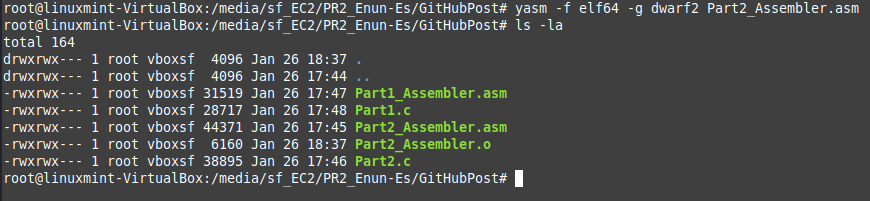
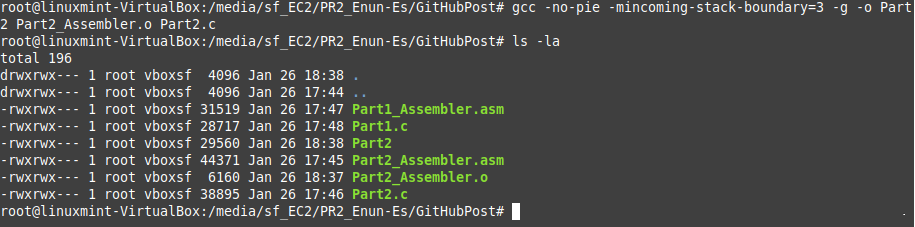
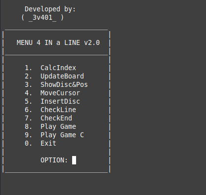
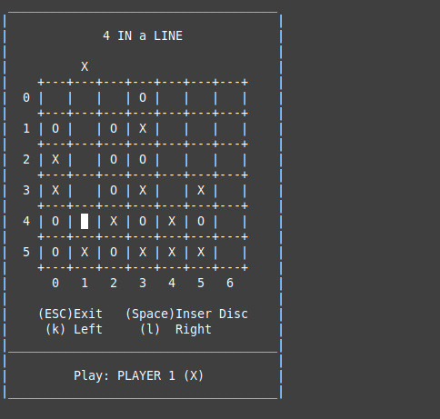
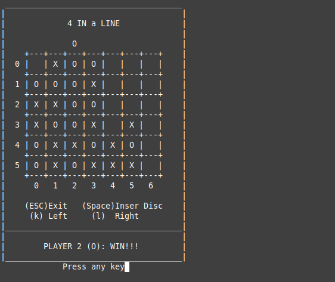

## Project: Four in a row.

This project aims to show how high-level C code interacts with low-level `x86_64` architecture assembly language. It provides a "hands-on" exploration into the gap between software and hardware by simulating Connect 4 game with a CMD interface alternating between C and assembly subroutines. The `C` code provides functional high-level implementation of the game logic meanwhile assembly code mimics the C logic at a low-level interacting with CPU instructions, memory management and control flow.

This project was done for the subject "**Computer Architecture**" to:

1. Understand Data Flow, I/O control flow.
2. Memory management (Use relative and indexed addressing to interact with matrices and arrays in memory).
3. Learn CMD interaction.
4. Gain experience in low-level programming, debugging and assembly code.

### Part 1: Core Functionality:

For part one the student must define the following subroutines:

1. calcIndexP1
2. updateBoardP1
3. showDiscPosP1
4. moveCursorP1
5. insertDiscP1
6. checkEndP1

### Part 2: Winning condition:

Part two of the project extends functionality to detect a winner by checking for 4 connected discs in horizontal, vertical, or diagonal lines. The subroutines to define are:

1. calcIndexP2
2. updateBoardP2
3. showDiscPosP2
4. moveCursorP2
5. insertDiscP2
6. checkLineP2
7. checkEndP2

### Test the implementation

To test the implementation in assembly comment the corresponding C subroutine call. For example, in `Part1.c`, go to Line 630, uncomment `calcIndexP1();` and comment `calcIndexP1_C();`. This will call the assembly implementation and not the C implementation. It should look something like this:

```
        //=======================================================
        calcIndexP1();
        //calcIndexP1_C();
        //=======================================================
```

This can be done with every subroutine.

### Running the program

To execute the program we need a compiler. A compiler is a program that translates high-level programming code (C, Python...) into machine code (binary or assembly) that the computer hardware can understand and execute. This tool converts human-readable code (C) into executable programs.

##### Types of Compilers

1. Native Compilers: Converts high-level code into machine code for the same system it runs on (GCC, Clang, MSVC)
2. Cross Compilers: Generates code for a platform other than the one it is running on (ARM GCC, MinGW, XC16 Compiler).
3. Just-In-Time (JIT) Compiler: Translates code at runtime for execution (Java HotSpot JVM, V8, LLVM JIT)
4. Interpreting Compiler: Compiles and executes code line-by-line (Python interpreter, Ruby MRI, Perl Interpreter)

In our example we will use GCC (GNU Compiler Collection) that compiles C code and links it with the assembler code to create an executable. It ensures the C and assembly codes work together.

To run the program execute:

```
yasm -f elf64 -g dwarf2 Part2_Assembler.asm
```

1. `yasm`: Assembler used to translate the assembly code into object file.
2. `-f elf64`: Specifies the output format (Executable and Linkable Format for 64-bit).
3. `-g dwarf2`: Include debugging information in DWARF2 format.
4. `Part2_Assembler.asm`: The input assembly to be compiled.



This command compiles the assembly code into a 64-bit object file ready for linking (`Part2_Assembler.o`). Then execute:

```
gcc -no-pie -mincoming-stack-boundary=3 -g -o Part2 Part2_Assembler.o Part2.c
```

1. `gcc`: GNU C Compiler used to compile and link the program
2. `-no-pie`: Disables Position Independent Executable (PIE) format to ensure fixed memory addresses for easier debugging.
3. `-mincoming-stack-boundary=3`: Specifies the stack alignment to 8 bytes (2^3) to match the stack alignment used in the assembly code.
4. `-g`: Includes debugging information
5. `-o Part2`: Output executable name
6. `Part2_Assembler.o`: Object file generated from the assembly code
7. `Part2.c`: The C source file to compile and link with the assembly code.



8. This command links the assembly object file (`Part2_Assembler.o`) and the C code (`Part2.c`) into a single executable (`Part2`) with debugging information. Execute the output file with `./Part2`



You can start playing!



Keep playing until one of them wins!



🥳 Player 2 (circles) won! 🥳
